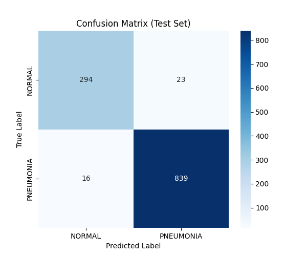
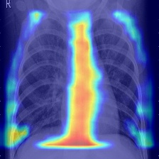
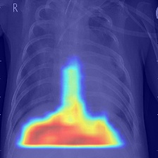
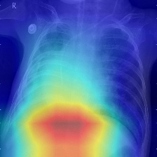
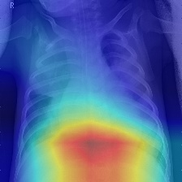
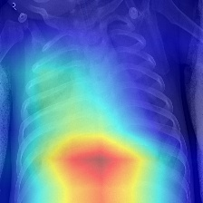
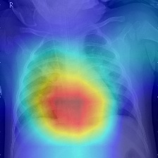
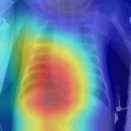

# Chest X-Ray Pneumonia Classification  


### From Baseline CNN to ResNet-18: A Study on Performance and Shortcut Learning

---

## 1. Introduction

Pneumonia classification from chest X-ray images is a classical yet challenging problem in medical image analysis. While deep convolutional neural networks often achieve high predictive accuracy, such performance does not necessarily imply clinically meaningful feature learning.

This project investigates:

- The performance gap between a custom-built CNN and a transfer-learning-based ResNet-18.
- The reliability of model decisions through Grad-CAM interpretability analysis.
- The presence of Shortcut Learning behaviors in medical imaging models.

Rather than solely pursuing higher accuracy, this study emphasizes model reliability and interpretability.

---

## 2. Dataset and Preprocessing

The original dataset (~2GB) was reorganized under a strict 7:2:1 split:

- 70% Training  
- 20% Validation  
- 10% Testing  

Preprocessing pipeline:

- Resize to fixed resolution  
- Convert grayscale to RGB  
- Normalize using ImageNet mean and standard deviation  
- Tensor conversion via PyTorch transforms  

---

## 3. Model Development

### 3.1 Baseline Model — Custom CNN

A convolutional neural network with four convolutional blocks was implemented from scratch.

Observations:

- Limited representational capacity  
- Tendency to overfit  
- Grad-CAM revealed attention misalignment  

---

### 3.2 Advanced Model — ResNet-18 (Transfer Learning)

The backbone was replaced by ResNet-18 pretrained on ImageNet.

Training strategy:

- Initial learning rate: 5e-4  
- Learning rate decay to 5e-5 at Epoch 18  
- Cross-entropy loss  
- Adam optimizer  

This strategy stabilized validation loss and improved convergence.

---

## 4. Quantitative Results

### Final Test Metrics

- Accuracy: 97.70%  
- Precision: 97.69%  
- Recall: 97.70%  

### Confusion Matrix Analysis

<p align="center">
  
</p>

Precision (97.69%) indicates that among all samples predicted as Pneumonia, 97.69% were truly positive. In medical contexts, this metric is critical because false positives may lead to unnecessary clinical interventions.

---

## 5. Interpretability Analysis — Grad-CAM

### Baseline CNN

<p align="center">
  
</p>

<p align="center">
  
</p>

The baseline CNN focused on spinal structures rather than pulmonary opacities, indicating spurious correlation learning.

### ResNet-18

<p align="center">
  
</p>
<p align="center">
  
</p>
<p align="center">
  
</p>
<p align="center">
  
</p>
<p align="center">
  
</p>

ResNet-18 achieved higher accuracy but shifted attention toward diaphragm regions and image boundaries, suggesting Shortcut Learning behavior.

---

## 6. Discussion

This study demonstrates:

- Accuracy alone is insufficient for evaluating medical AI systems.
- Deep models may exploit structural biases.
- Interpretability tools are essential for reliability assessment.

---

## 7. Future Work

- Introduce attention mechanisms (CBAM)
- Conduct ablation studies
- Quantitatively measure attention alignment
- Integrate lung segmentation masks

- ## 8. Quick Start
```bash
git clone https://github.com/Beyond39/Chest-XRay-CNN-ResNet-GradCam.git
cd Chest-XRay-CNN-ResNet-GradCam
pip install -r requirements.txt
python src/run_gradcam.py
